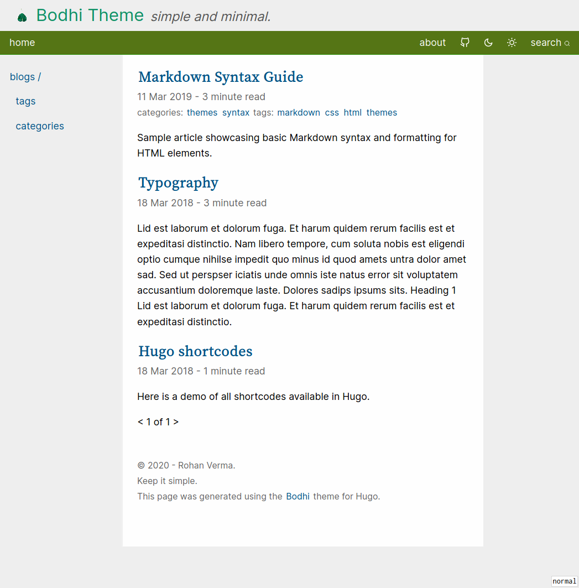

+++
title = "Bodhi"
description = "A minimal Hugo theme for personal websites. No longer maintained."
weight = 10

[extra]
github_url = "https://github.com/rhnvrm/bodhi"
demo_url = "https://themes.gohugo.io/themes/bodhi/"
status = "archived"
+++

*This project is no longer actively maintained. I've since migrated my own site to Zola.*

A simple, minimal personal website theme for Hugo that I built and used for my own site for several years.

## Features

- Google and Fathom Analytics integration
- Syntax highlighting
- Dark mode support
- Twitter cards and OpenGraph tags
- Disqus and Commento comments
- RSS feeds
- Inbuilt search support
- Reading time estimates
- Two navigation menus (menu bar + navigation tree)

## Screenshots




## Install

```bash
git submodule add https://github.com/rhnvrm/bodhi themes/bodhi
```
