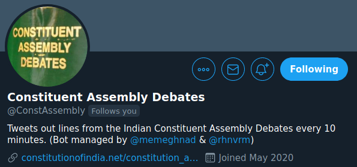

I maintain a couple of twitter bots. Here are a few of them:

## Constituent Assembly Debates

[Github](https://github.com/rhnvrm/ConstAssemblyBot) | [Twitter](https://twitter.com/ConstAssembly)

Tweets out lines from the Indian Constituent Assembly Debates every 10 minutes. Content is curated by [@memeghnad](https://twitter.com/memeghnad). The bot was written using Tweepy and runs as a cronjob. 

